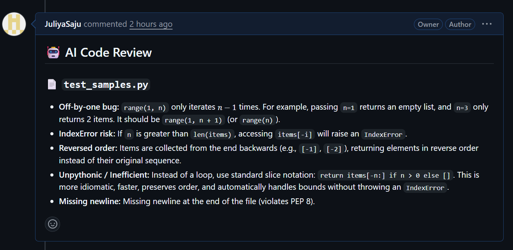

# AI PR Reviewer Bot

An automated code review tool that analyzes GitHub Pull Requests using an AI model and posts review feedback directly on the PR. The system listens for pull request events via webhooks, retrieves the code changes, and generates a review covering bugs, security issues, and code quality concerns.

## Overview

When a pull request is opened, the application:

1. Receives a webhook notification from GitHub
2. Retrieves the code diff for the pull request via the GitHub API
3. Submits the diff to Google's Gemini model with a structured review prompt
4. Posts the generated review as a comment on the pull request

## Technology Stack

- **Backend:** Python, FastAPI
- **AI Model:** Google Gemini API (gemini-3.8-flash)
- **Integration:** GitHub REST API, GitHub Webhooks
- **Local Development:** ngrok

## Validation

To evaluate the reliability of the AI-generated reviews rather than assuming correctness, a validation test was conducted using five code samples, each containing one deliberately introduced defect. Each sample was submitted as a separate pull request to measure detection accuracy.

| Defect Type | Detected |
|---|---|
| SQL injection vulnerability | Yes |
| Missing bounds check (potential IndexError) | Yes |
| Hardcoded API credential | Yes |
| Off-by-one loop error | Yes |
| Unclosed file resource | Yes |

**Detection rate: 5/5 (100%)**

The off-by-one defect is a notable result, as it required the model to reason about loop execution behavior rather than match a known vulnerability pattern.

The testing process also surfaced a limitation: the model incorrectly flagged a current, valid model identifier (`gemini-3.8-flash`) as invalid, recommending an older, deprecated model instead. This occurred because the model's training data predates the release of that identifier. This finding illustrates the importance of independently verifying AI-generated output before relying on it in production contexts.

## Known Limitations

- Reviews are posted as a single general comment rather than inline, line-specific annotations
- Webhook payloads are not currently verified using GitHub's signature header
- The application currently runs locally via ngrok and has not yet been deployed to a persistent hosting environment

## Setup Instructions

1. Clone the repository and create a virtual environment
2. Install dependencies: `pip install -r requirements.txt`
3. Create a `.env` file containing `GEMINI_API_KEY` and `GITHUB_TOKEN`
4. Start the server: `uvicorn main:app --reload`
5. Expose the local server using ngrok and configure the resulting URL under the repository's Settings → Webhooks

## Deployed on Render